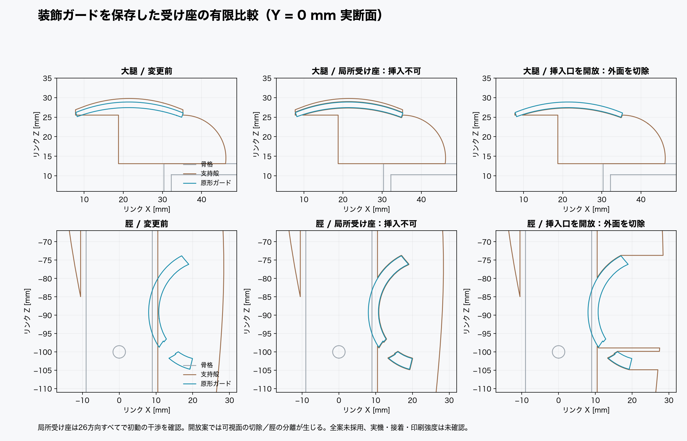

# 大腿・脛ガードの受け座を設ける有限比較

**全6候補を不採用とする。本流のSTL・CADは変更していない。** 原形ガードをそのまま保ち、支持殻だけに局所受け座を作ると実物の挿入口がない。入口を開放すると見える外面の切除が必要で、脛は可視片が分離する。ガードと骨格の交差も別に残る。

根因は `tools/data/kit_assembly_front.json` の配置最適化が `signed_distance≈+1mm` を目的にし、固体への埋没を「接着に適したフィット」と扱っていたこと。`hardware/src/shell_mod.py` の shin_shell/thigh_cap は、ガード形状を差し引かない。実体積の重複は大腿1211.944mm³（ガードの81.127%）、脛1146.758mm³（77.940%）。過去の頂点埋没率は、組立可能性の判定になっていなかった。

受け座はガードのMinkowski和で作成した。外接二十面体による最小隙間0.10/0.15mmで、最大拡大量は0.126/0.189mm。STL丸めによる退化面を区別するため、元の生成結果と0.01mm簡略化後の両方を保存した。原形ガードは無加工。

| 部品・案 | 保存STLの閉体 / 体数 | 26方向の最良初動最大交差 mm³ | ガード近傍0.2mm外の元外面切除 mm² | 判定 |
|---|---|---:|---:|---|
| 大腿 局所 0.10mm | 閉体 / 1 | 67.772 | 0.0 | 不採用 |
| 大腿 開放 0.10mm | 閉体不成立 / 37 | 0.000 | 724.7 | 不採用 |
| 大腿 局所 0.15mm | 閉体 / 1 | 41.350 | 0.0 | 不採用 |
| 脛 局所 0.10mm | 閉体 / 1 | 163.698 | 0.0 | 不採用 |
| 脛 開放 0.10mm | 閉体不成立 / 12 | 0.000 | 542.5 | 不採用 |
| 脛 局所 0.15mm | 閉体 / 1 | 142.009 | 0.0 | 不採用 |

局所受け座の方向比較は、各軸成分{-1,0,1}からゼロベクトルを除いた26方向、初動0.25/0.5/1.0mm。全方向に正の体積交差がある。これは有限の並進案に対する反証で、回転を組み合わせた全経路の不可能性まで証明していない。

大腿の開放案は+Z方向、脛は+X方向にガード包絡を64mm連続掃引して受け座を開いた例。大腿では上面の約724.7mm²（x7.81..35.22、y−12.06..13.05、z21.82..29.76mm）をガードから0.2mm以上離れて切る。脛では約542.5mm²（x21.09..28.43、y−13.42..12.77、z−105.10..−72.83mm）を切り、CAD上も約283.00mm³の片が本体から分離する。上表のSTL体数には丸め由来の退化面も含まれるが、脛の2体化はCADの実体分解でも再現しており、単なるSTL数値不良とは違う。外面切除の面積・範囲は元メッシュの面中心標本で、全視点の遮蔽面積ではない。

骨格自体は編集していない。ガード–femur交差はFL/RR9.194mm³、FR/RL17.030mm³、ガード–tibiaは全脚約65.413mm³が残る。左右配置は現KITの鏡映とBoolean差が0.000313mm³以下で一致し、一脚だけの座標取り違えではない。

大腿の接着下面z13.1..13.9mmの保存領域では、局所受け座で2.47/3.51mm³、開放案で2.48mm³を失う。脛のM3長穴2箇所はx±6、各z±9、Y全長の比較領域を置き、厳密CAD切削では損失0。STL用簡略化後に約0.085mm³の差が出るため、厳密な材料完全保持とは記載しない。骨格–ガードの交差も残るため、これだけを次の印刷へ移さない。

次の設計では、支持殻を分割してガードを挟み込む方式、原型の接合面を復元した配置、または可視面を変更する量を明示した受け座を比較する必要がある。ガードを切って分割する案は今回対象外。

再現: `tools/design_guard_seat_candidates.py`。表示: `tools/render_guard_seat_candidates.py`。`guard-seat-candidates/comparison.json` が簡略化前、`comparison-final.json` がSTL再読・26方向・左右・支持領域まで含む結果。全STLはリンク座標系の候補専用で、`hardware/stl`へ自動配置しない。接着力・印刷強度・局所壁厚はUNVERIFIED。

