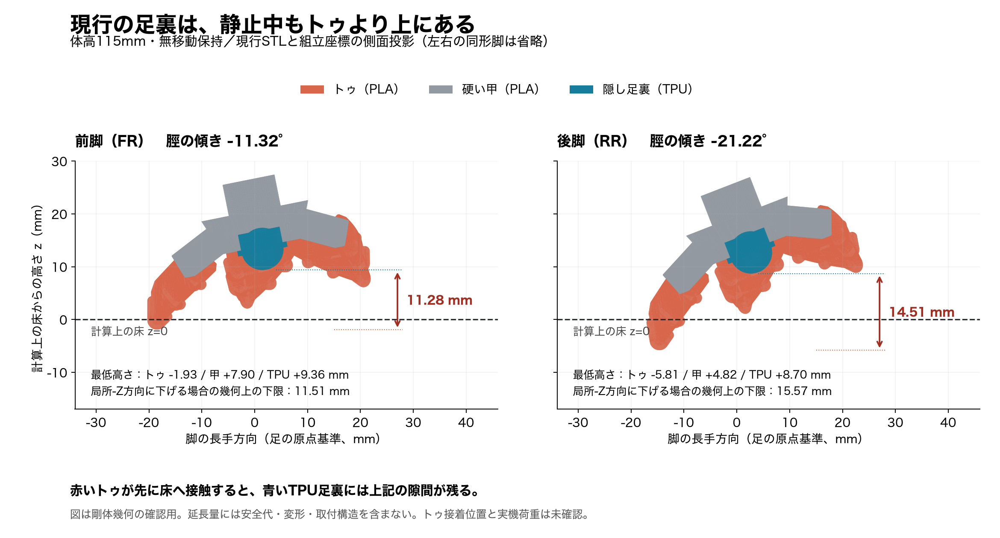
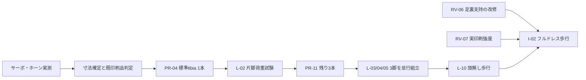

# タチコマ独立監査 — 2026-09-05

**現状のまま実機が安定して歩けるとは判定できない。通常立位でもトゥがTPU足裏より先に接地する、機構上の重要な問題が残っている。**
一方、操作画面・安全停止・起動・音声・シミュレーション・印刷データ生成・Issue運用の再現可能な不具合は、ローカルで修正と回帰検証を行った。

作業ブランチ: `codex/audit-20260905`。開始時は `42aa7fd`、未コミット変更なし。
監査開始時の307追跡ファイルをリポジトリ外へ退避済み（場所は [baseline.json](baseline.json)）。
キットの外観、CAD寸法、STL、既存3MF、旧動画・旧測定JSONは保持した。
GitHubにはIssueと依存関係を反映。コードはローカル変更であり、push・実機書込み・印刷・追加購入は実施していない。

## 最優先の未解決事項

### 足裏支持の前提が成立しない — RV-06 / #87

体高115mmの停止保持で、前脚のトゥはTPUより11.28mm、後脚は14.51mm低い。
これは床への実際の沈み込み量ではなく、同じ脚のどの部品が先に触れるかを示す差である。
体高110〜130mm・小歩幅〜最大指令を走査した324,020姿勢のうち、接地相243,020姿勢すべてでトゥが先行した。
トゥを外しても硬い足本体がTPUより先に触れる姿勢がある。

従来の接地検査は「硬い足本体とTPUを合わせた最下点」を見ており、TPUへの荷重を確認していなかった。
MuJoCoも足全体を単一凸包・同じ摩擦で扱う。したがって、数値シムで歩けても、細いトゥや接着部の耐荷重・実際の滑りは証明できない。

単純な足裏延長では、既定保持の後脚だけで局所軸方向に最低15.57mm、今回の歩行範囲では最大26.39mmが必要となる。
安全代・取付強度・座屈は含まない。外観と歩容への影響が大きいため、この長さの部品を無検証で追加する修正はしていない。
**次は現物のトゥ取付姿勢を図と照合し、元形状を保存した内部支持・着脱支持の具体案を決める。**
足の接着位置は元記録でも確度に限界があるため、現物照合が必要。

根拠: [機構監査](mechanical.md)、[診断JSON](toe_contact.json)、[Issue #87](https://github.com/hapx2yuki/Tachikoma/issues/87)。
新規診断 `check_toe_contact.py` はこの未解決問題に対して終了コード1を返す。

### 印刷物の強度と動力の余裕 — RV-07 / #88、既存 #37 / #75 / #77

- 既存の強度検査は中実断面・文献強度による計算。4壁/40%充填の印刷物を実測した結果ではない。
  壁と低密度コアを分けた感度計算では、pod_neckの安全率が2.71〜2.79となり、既存要求3を下回った。
  これは実破断の確定ではなく、実荷重・たわみ試験を省けない根拠。
- `claw_mount_L.3mf` には腕7部品が壁2/15%で保存されている。そこから印刷した品を4壁/40%の強度前提で扱わない。
- 静的股ピッチ最悪18.50kgf·cmは既存閾値20以内だが、購入したサーボの6V連続保持能力・発熱は未測定。
  電源の連続容量、電圧降下、実重量・重心も、実機の計測で確定する。

根拠: [強度感度JSON](strength_sensitivity.json)、[Issue #88](https://github.com/hapx2yuki/Tachikoma/issues/88)。
感度計算も要求未達を終了コード1で報告する。既印刷品の廃棄・一括再印刷は指示していない。

## 修正した欠陥

| 対象 | 変更前の問題 | 今回の修正 |
|---|---|---|
| 操作画面 | 変数初期化前の参照でJavaScriptが停止し、操作を初期化できない | 実行順を修正。通信断・画面非表示時に移動/PTTを零化 |
| 腕と脚 | 脚のスルー前目標で腕退避を早く解除する | 目標とスルー後の出力角の危険側を使う。実測角ではない点を明記 |
| 起動と停止 | 順次通電がフラグ操作だけ。校正モードは低電圧・脱力でも出力継続 | 100msごとに実PWMを1軸ずつ出力。校正でも低電圧ラッチと脱力を反映 |
| 指令の共有 | 通信処理と制御処理で状態が競合、部分指令が脱力を解除し得る | ロックした指令状態を制御周期に反映。不正値・非有限数を拒否 |
| 音声 | INMP441に必要なI2Sスロット幅、リング状態、通信処理、TTS送信間隔に欠陥 | PCM16bitを維持して32bitスロット化。通信/リング/送信間隔の回帰を追加 |
| 配線説明 | PCA9685 VCCをESP32の3.3Vへつなぐ指定が無い | PCA2枚のVCC、論理プルアップとサーボV+の分離を明記 |
| 幾何・歩容検査 | NGでもexit0、ブーリアン失敗をNaNにして見逃す | 非0終了と計算失敗の明示。既存閾値を緩めず、失敗を注入した試験を追加 |
| 物理シム | 横移動を前進と表示。停止SWAY・50Hz・出力スルーを再現せず、転倒でもexit0 | 実C++との時系列比較、方向別移動量、明示的合否、トルク速度近似と飽和計測 |
| 3MF生成 | foot_padの再生成時にPLA割当へ戻る。手動編集済み3MFを一括上書き | TPU設定保持。別出力先を既定にし、既存ファイルの上書きを明示指定に限定 |
| Issue同期 | 再実行で進捗をTodo/Readyへ戻す。文書の生成節が重複 | 既存Status保持、対象キー限定、依存の明示的整理、重複拒否、再実行の冪等性確認 |

詳細: [制御・音声](firmware.md)、[機構・印刷・配線](mechanical.md)、[シミュレーション](simulation.md)。

## 検証の結果と限界

| 確認 | 結果 | 根拠 |
|---|---|---|
| 全STL→頭部加工→URDF再生成 | 成功。既存hardware/modelの追跡ファイルとSHA-256全一致 | [生成ログ](logs/build-all.log)、[頭部](logs/make-head-eyecut.log)、[URDF](logs/export-urdf.log) |
| 既存の全12チェッカー（脚リンク強度を含む） | 修正後すべて終了コード0 | [最終一覧](logs/final-results.json) |
| 幾何/歩容の失敗検出回帰 | 4件成功。計算失敗・NaN・トルク不足・干渉を拒否 | [ログ](logs/test-audit-gates.log) |
| Issue同期の回帰 | 7件成功。進捗保持、重複、依存整理、排他モードを確認 | [ログ](logs/test-issue-sync.log) |
| 現行の印刷用3MF | 26ファイル101objectの形状一致。数量/弱い印刷条件には要確認あり | [結果](print_artifacts.json) |
| 実C++歩容との比較 | 1,077フレーム、最大差0.000895度。7回帰成功 | [ログ](simulation/regression.log) |
| MuJoCo | 公称・摩擦/重量/トルク変更・後退・横移動等9条件で条件付き合格 | [条件別集計](simulation/scenario_summary.json) |
| MuJoCoの破綻検出 | 摩擦0では数値不安定を検出して不合格・非0終了 | [ログ](simulation/zero_friction.log) |
| 足裏単独支持 | **不合格、未修正** | [図](foot_contact_115mm.png)、[診断](toe_contact.json) |
| 印刷物の強度 | **感度計算で要求未達あり、実測未確認** | [診断](strength_sensitivity.json) |
| 実機 | **UNVERIFIED**。通電・書込み・印刷・荷重試験・歩行をこの監査では実施していない | 既存の実機Issueで確認 |

通常/校正のファームウェアビルドとホスト回帰のログは [制御監査](firmware.md) を参照。
実機の関節符号、PWM範囲、校正、起動・脱力後の経路、I2S波形は別の確認事項。
特に初期角0度から立位への途中姿勢は定常IKの検査範囲に収まるとは限らず、支持台での実機確認が必要。

公称シムの前進は **145.59mm / 比較時間6.4秒**、旋回18.60度、最大roll3.32度、脚の最悪飽和時間率0.262%。
初期状態を立位に配置し、推定質量2.78985kg・剛体・自己衝突なし・全足一様摩擦という条件での値。
摩擦0.25では横ずれ62mmがあり、直進精度も未保証。
[修正版の13秒動画](simulation/forward_nominal.mp4) は実機動画ではない。

## Issueと実際の進め方

既存77件を活用し、今回9件を追加して計86件。既存の物理試験を証拠なしでCloseしていない。
コード修正のIssueも、ローカル検証・コード反映・実機試験の状態を区別して記録する。

| 並行して進める作業 | 最後に合流する条件 |
|---|---|
| [制御 #81](https://github.com/hapx2yuki/Tachikoma/issues/81)、[印刷データ #82](https://github.com/hapx2yuki/Tachikoma/issues/82)、[物理シム #78](https://github.com/hapx2yuki/Tachikoma/issues/78)、[Issue同期 #84](https://github.com/hapx2yuki/Tachikoma/issues/84) | [検査判定 #83](https://github.com/hapx2yuki/Tachikoma/issues/83) と合わせ [統合監査 #85](https://github.com/hapx2yuki/Tachikoma/issues/85) |
| [サーボ実測 #13](https://github.com/hapx2yuki/Tachikoma/issues/13)、[印刷済み棚卸し #12](https://github.com/hapx2yuki/Tachikoma/issues/12)、[足支持 #87](https://github.com/hapx2yuki/Tachikoma/issues/87)、[電源確認 #28](https://github.com/hapx2yuki/Tachikoma/issues/28) | 実測値→config確定→片脚試験 |

- 電源対策EL-09とトルク対策L-11は、試験の不合格時にも着手できるよう、合格済みIssue待ちを解除した。
- プリンタは1台の作業として直列。本体を同時に触る作業も重ねない。CAD/制御/配線準備の担当ファイルは分ける。
- 既印刷品は版と設定を照合して再利用する。購入済みサーボの交換や昇圧は、型番・実測・電源分離を確認してから判断する。
- トゥの切削や見える形状の変更は、プロジェクトの `AGENTS.md` に従いオーナー判断。今回の診断だけで外観を変更していない。

[監査親Issue #80](https://github.com/hapx2yuki/Tachikoma/issues/80) / [既存Project](https://github.com/users/hapx2yuki/projects/2) / [全体計画](../../build_plan.md)。
依存はGitHubのblocked by関係として登録し、本文だけの説明にしていない。
全86件の親子関係・依存130件を読み戻して計画との一致を確認し、既存の空欄でないStatusは保持した。
根拠: [GitHub照合結果](logs/github-verification.json)。
[GitHub公式の依存関係説明](https://docs.github.com/en/issues/tracking-your-work-with-issues/using-issues/creating-issue-dependencies)に沿っている（確認2026-09-05）。
