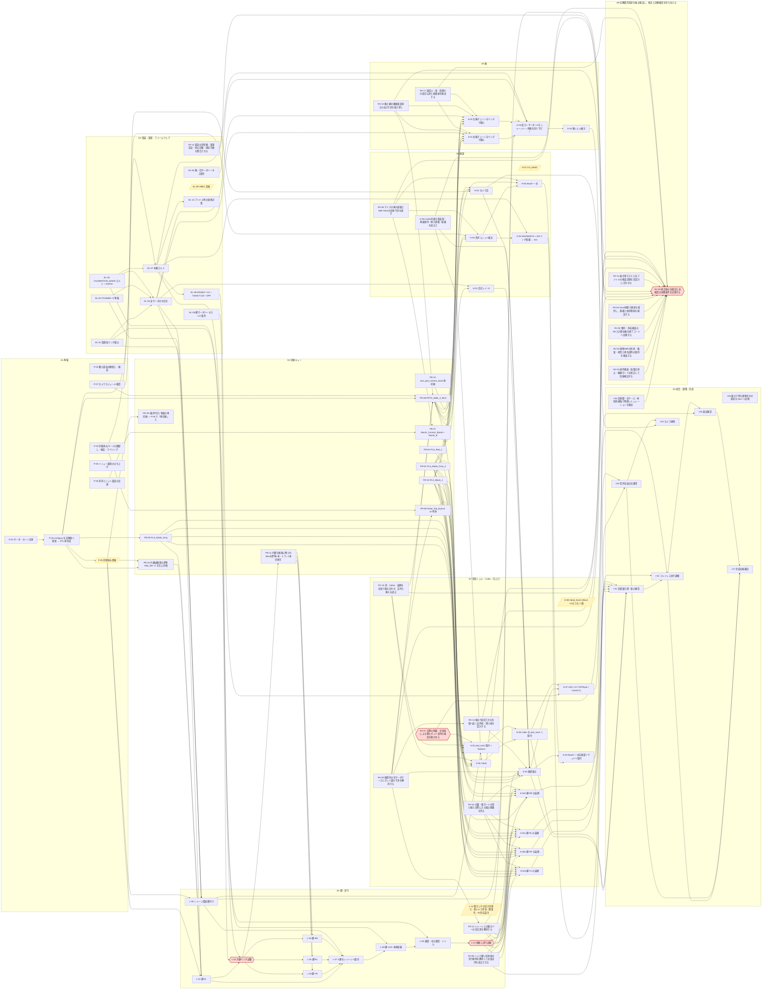

# 物理製作 ビルドプラン — Issue駆動で複数人が並行するための全体図

作成 2026-09-03。計画の正は [`tools/issues/plan.py`](../tools/issues/plan.py)、
GitHub Issues への同期は [`tools/issues/sync_github_issues.py`](../tools/issues/sync_github_issues.py)、
作業の取り方は [`CONTRIBUTING.md`](../CONTRIBUTING.md)、
ボードは [GitHub Project「Tachikoma 物理製作」](https://github.com/users/hapx2yuki/projects/2) (Public)。
**部品は調達済み、印刷は一部完了** (2026-08-31 スナップショット) という現況を起点にしている。

**2026-09-05 更新:** [第2次監査](audits/20260905-round2/README.md) に基づき、E9で修正を管理。
片脚用tibia (`PR-04`) → 片脚合格 (`L-02`) → 残り3本 (`PR-11`) の順。
トルク/電源対策は試験の失敗時にも着手できるよう合格待ち依存を外した。
フルドレス歩行 (`I-02`) は足裏支持 (`RV-06`) と印刷物強度 (`RV-07`) の確認後に行う。
自動生成された依存と `plan.py` を正とする。

## 1. 構造 (2 軸 + 依存)

- **マイルストーン = いつ (Go/No-Go ゲート)**
  `M0 準備完了` → `M1 片脚 Go/No-Go` (1.2kg リフト) → `M2 頭無し歩行` → `M3 サブアセンブリ` → `M4 フルドレス` → `M5 統合・完成`
- **エピック = 何の流れ (作業ストリーム, サブイシューで束ねる)**
  `E1 準備` / `E2 印刷キュー` / `E3 電装・ファーム` / `E4 脚・歩行` / `E5 腕` / `E6 頭部 (目・カメラ・音声)` / `E7 意匠シェル・Cabin` / `E8 統合` / `E9 独立監査`
- **依存 = 順番** — GitHub の blocked by / blocking。`is:open -is:blocked` で「今できること」が出る
- **占有リソース** — `res/プリンタ` (X2D 1 台 = 印刷は 1 本のキュー) / `res/本体` (シャーシ組立品)。それ以外は `並行作業OK`

## 2. 同時に進める作業と順序を守る作業

| 独立に進められる作業 | 次へ進む条件 |
|---|---|
| P-01/P-03: 購入型番・サーボ寸法/角度の照合 | P-04へ実測値を渡す。未確認の型番を設計値と同一視しない |
| P-02: 印刷済み品と使用3MFの照合 | 既印刷品を保存し、P-05で再利用・加工・再印刷を部品ごとに判断 |
| RV-08: 音声、RV-09: 頭部、RV-10: 腕脚、H-06: Cabin | 共通の配置/配線/荷重面を先に合意し、部位ソースを分担する |
| RV-11/EL-09/L-11: 電源・必要トルクの調査と対策 | 歩行/片脚試験の合格待ちにしない。失敗ログも対策の入力にする |
| RV-01/RV-12: 制御・表示の整合 | 実firmwareの出力を物理計算へ渡し、表示だけの動作を実証としない |

設計変更後は **STL再生成 → URDF再生成 → 全検証 → 対象3MF作成** の順で一人が統合する。
同じ出力を複数担当が同時に生成しない。プリンタは1台なので、試験用の片脚を優先して順に使う。
**PR-04の標準tibia1本 → L-02の片脚試験 → PR-11の残り3本** が脚の印刷順。
RV-09の取付軸確定 → RV-13頭固定/RV-14脚カバーの順。RV-15首/CabinはH-06電装室と境界を合わせ、同じmake_chassis.pyを同時編集しない。
H-06の内部室/着脱保持とRV-15全接合が成立する前にCabinを接着して閉じない。
RV-16のガード受け座とRV-17の固定手は局所形状の検討を並行できる。全身の軸配置へ影響する寸法はRV-09/10/14と共有し、実部品の接着は両課題の検証後とする。
フルドレス歩行I-02はRV-06の足裏支持とRV-07の印刷物強度の確認後に行う。

## 3. 担当の分け方

CAD担当はファイルの所有範囲をIssueへ書く。電装担当は型番/電圧/配線図と測定条件、
印刷担当は使用3MFのハッシュ・材質・向き・壁数、実機試験担当は動画と計測値を残す。
共有config.pyとSTL出力を変更するときは統合担当へ引き渡す。
`並行作業OK`は他Issueとの共有ファイル競合や依存を解除する意味ではない。

## 4. 現時点の製作条件

- H-06: Cabin電装室・棚・Backの保持/配線を検査してからS-05へ渡す。
- RV-09/H-02: 頭部の実ケース収納とXIAO/カメラ/FPCが成立してから頭部印刷・接着。
- P-05: 購入済みサーボ・印刷済み品に合わせ、再利用可能な部品を優先する。
- H-07: CH_HEADは予約専用・PWM停止を実装。実機でch12が停止していることを確認。
- S-08: Head_Insert_Blackの未確定2個は元写真/実物で確認する。
- L-09: 機体を支持して起動し、明示的な立位操作で通電。USBと外部5Vを同時接続しない。

## 5. 自動生成部 (依存グラフ・一覧)

以下は `sync_github_issues.py --plan-doc` が `issue_map.json` から生成する。手で編集しない。

<!-- BEGIN GENERATED (tools/issues/sync_github_issues.py --plan-doc) -->
_生成: 2026-09-05 / イシュー数 96 / 依存 173_

### 依存グラフ (矢印 = 先行 → 後続。エピックは省略)

### 今すぐ着手できるイシュー (依存なし)

- #11 P-01 [運営] 購入部品の棚卸し・検品 (BOM / shopping.md D-1 と照合)  ← 並行作業OK
- #12 P-02 [運営] 印刷済みパーツの棚卸し・検品・ラベリング (旧 rev 混入チェック)  ← 並行作業OK
- #13 P-03 [測定] サーボ・ホーン実測 (STD ×14 / MG90S ×6 / ES9251II ×3) → 実測表  ← 並行作業OK
- #16 P-06 [測定] 音声ユニット部品の実測 (INMP441 基板 / φ20 SPK 厚) → AUDIO_* 更新 → check_audio  ← 並行作業OK
- #17 P-07 [測定] カメラモジュール確認 (XIAO ESP32S3 Sense: センサー型番・子基板寸法・FOV) → CAM2_* 更新 → check_camera  ← 並行作業OK
- #18 P-08 [運営] イシュー運用の立ち上げ (CONTRIBUTING / テンプレ / Project ボード / 協力者招待)
- #19 PR-01 [印刷] PLA_Matte_Gray_2 — キット灰意匠 21 種 36 個 (70g / 3.7h, A3 灰)
- #20 PR-02 [印刷] PLA_Black_1 — トゥ×12 + 指×6 + Insert×12 (34g / 2.2h, 黒へ差替)
- #21 PR-03 [印刷] PLA_Red_1 — 赤ランプ 大×4 小×4 (2.5g, 赤へ差替 or 白+赤塗装)
- #79 PR-10 [印刷] eye_pod_camera_base 再印刷 (白 5g) — 印刷済み品は旧 rev (ポケット壁 ~1mm 違い)
- #28 EL-01 [電装] 電源系ベンチ組立 (LiPo→ヒューズ→SW→UBEC 6V / DC-DC 5V, バスバー, コンデンサ, 分圧)  ← 並行作業OK
- #29 EL-02 [電装] PCA9685 ×2 準備 (board1 A0 ジャンパ→0x41, ヘッダ実装規約) + ESP32 I2C 疎通  ← 並行作業OK
- #30 EL-03 [ファーム] CALIBRATION_MODE ビルド + ESP32 書き込み + AP 接続確認  ← 並行作業OK
- #32 EL-05 [配線] 脚サーボハーネス ×12 製作 (電源 AWG20→AWG16 バス分岐 / 信号 AWG26→PCA)  ← 並行作業OK
- #33 EL-06 [配線] 腕・目サーボハーネス製作 (MG90S ×6 / ES9251II ×2, AWG26/30)  ← 並行作業OK
- #75 EL-09 [要判断] UBEC 定格 (連続 10A) の妥当性 — L-10 の実測電流で 15〜20A 級への変更を判断
- #77 L-11 [要判断] 股ピッチの実力を測り、低トルク歩容・軽量化・6V対応品を比較する
- #55 H-06 [CAD] Cabin内部の電装室・基板保持・挿入経路・配線を成立させる  ← 並行作業OK
- #56 H-07 [要判断] CH_HEAD (ch12) の扱い — 駆動対象が実在しない (推奨: 予備維持)
- #67 S-08 [要判断] Head_Insert_Black ×4 のうち 2 個の位置 (3MF に座標無し → 実物写真で確定)
- #73 I-06 [ドキュメント] 組立で得た現物合わせ知見を docs へ反映 (assembly / wiring / print_manifest / HANDOFF)  ← 並行作業OK
- #78 I-08 [検証] 実制御・実ケース・材料別接触で物理シミュレーションを検証する  ← 並行作業OK
- #81 RV-01 [不具合] 操作画面・低電圧停止・腕脚ガードを修正して回帰検証する  ← 並行作業OK
- #82 RV-02 [検証] 現物3MFの形状・数量・材質と再生成時の保持を検査する  ← 並行作業OK
- #83 RV-03 [不具合] 幾何・歩容検査のNGと計算失敗を終了コードへ反映する
- #84 RV-04 [不具合] Issue同期で進捗を保持し、重複と依存関係を検証する  ← 並行作業OK
- #87 RV-06 [機構不具合] トゥと硬い足本体の先行接地を解消して足裏支持を成立させる
- #88 RV-07 [試験] 実際の壁数・充填率による脚とポッド支持の強度を確かめる
- #89 RV-08 [機構不具合] マイクの挿入経路とBall–Neckの実体干渉を直す  ← 並行作業OK
- #90 RV-09 [機構不具合] 頭部内の実サーボケースとポッド梁の干渉を解消する  ← 並行作業OK
- #91 RV-10 [機構不具合] 腕と脚の隣接部品同士の自己干渉を取り除く  ← 並行作業OK
- #92 RV-11 [電装] 部品の実型番・電源収支・停止回路・測定手順を整合させる  ← 並行作業OK
- #93 RV-12 [検証] 表示用モデルと全ファイルの検査記録を実設計に合わせる  ← 並行作業OK
- #96 RV-15 [機構不具合] 首・Cabin・装飾を全長で組み合わせ、支持と挿入を成立させる  ← 並行作業OK
- #97 RV-16 [機構不具合] 大腿・脛ガードの受け座と実際に入る組立経路を作る  ← 並行作業OK
- #98 RV-17 [機構不具合] 固定爪・指・指飾りの嵌合公差と接着座を検証する  ← 並行作業OK

### 一覧 (マイルストーン順)

| key | イシュー | マイルストーン | 前提 | 並行 |
|---|---|---|---|---|
| EL-01 | #28 EL-01 [電装] 電源系ベンチ組立 (LiPo→ヒューズ→SW→UBEC 6V / DC-DC 5V, バスバー, コンデンサ, 分圧) | M0 準備完了 | — | ✅ |
| EL-02 | #29 EL-02 [電装] PCA9685 ×2 準備 (board1 A0 ジャンパ→0x41, ヘッダ実装規約) + ESP32 I2C 疎通 | M0 準備完了 | — | ✅ |
| EL-03 | #30 EL-03 [ファーム] CALIBRATION_MODE ビルド + ESP32 書き込み + AP 接続確認 | M0 準備完了 | — | ✅ |
| EL-04 | #31 EL-04 [電装] 全サーボの中立化 (1500µs) とマーキング (STD ×14 / MG90S ×6 / ES9251II ×3) | M0 準備完了 | #28, #29, #30 |  |
| P-01 | #11 P-01 [運営] 購入部品の棚卸し・検品 (BOM / shopping.md D-1 と照合) | M0 準備完了 | — | ✅ |
| P-02 | #12 P-02 [運営] 印刷済みパーツの棚卸し・検品・ラベリング (旧 rev 混入チェック) | M0 準備完了 | — | ✅ |
| P-03 | #13 P-03 [測定] サーボ・ホーン実測 (STD ×14 / MG90S ×6 / ES9251II ×3) → 実測表 | M0 準備完了 | — | ✅ |
| P-04 | #14 P-04 [CAD] config.py を実測値へ更新 → STL 再生成 → 全チェッカー緑 → 影響パーツ判定 | M0 準備完了 | #13 |  |
| P-05 | #15 P-05 [要判断] 印刷済み骨格 (chassis / coxa×4 / femur×4 / arm_pod) の再印刷要否 | M0 準備完了 | #14 |  |
| P-06 | #16 P-06 [測定] 音声ユニット部品の実測 (INMP441 基板 / φ20 SPK 厚) → AUDIO_* 更新 → check_audio | M0 準備完了 | — | ✅ |
| P-07 | #17 P-07 [測定] カメラモジュール確認 (XIAO ESP32S3 Sense: センサー型番・子基板寸法・FOV) → CAM2_* 更新 → check_camera | M0 準備完了 | — | ✅ |
| P-08 | #18 P-08 [運営] イシュー運用の立ち上げ (CONTRIBUTING / テンプレ / Project ボード / 協力者招待) | M0 準備完了 | — |  |
| L-01 | #36 L-01 [組立] 脚 FL (標準版) を組む — 片脚ゲート用の 1 本目 | M1 片脚 Go/No-Go | #22, #23, #31, #15 |  |
| L-02 | #37 L-02 [ゲート] 片脚ベンチ試験 — 1.2kg×レバー155mm (=18.6kgf·cm) 保持 (6V) / スイープ / 保持電流 | M1 片脚 Go/No-Go | #36, #28, #30 |  |
| L-11 | #77 L-11 [要判断] 股ピッチの実力を測り、低トルク歩容・軽量化・6V対応品を比較する | M1 片脚 Go/No-Go | — |  |
| PR-04 | #22 PR-04 [印刷] 片脚試験用の標準 tibia_link ×1 を先に印刷する | M1 片脚 Go/No-Go | #14, #15 | 🖨 |
| PR-05 | #23 PR-05 [印刷] PLA_Matte_Gray — leg_foot_bored ×4 + thigh_cap ×4 (Mouth 2 点は除外, A3 灰) | M1 片脚 Go/No-Go | #14 | 🖨 |
| PR-09 | #27 PR-09 [印刷] (条件付き) 骨格の再印刷 — P-05 で「再印刷」と決まった部品のみ | M1 片脚 Go/No-Go | #15 | 🖨 |
| EL-05 | #32 EL-05 [配線] 脚サーボハーネス ×12 製作 (電源 AWG20→AWG16 バス分岐 / 信号 AWG26→PCA) | M2 頭無し歩行 | — | ✅ |
| EL-07 | #34 EL-07 [ファーム] 本番ビルド (CALIBRATION_MODE 解除, JOINT_SIGN/ARM_SIGN 確認) + 書き込み + Web UI 動作 | M2 頭無し歩行 | #30, #14 |  |
| EL-09 | #75 EL-09 [要判断] UBEC 定格 (連続 10A) の妥当性 — L-10 の実測電流で 15〜20A 級への変更を判断 | M2 頭無し歩行 | — |  |
| L-03 | #38 L-03 [組立] 脚 FR (ミラー版 `_m`) を組む | M2 頭無し歩行 | #37, #86 | ✅ |
| L-04 | #39 L-04 [組立] 脚 RL (ミラー版 `_m`) を組む | M2 頭無し歩行 | #37, #86 | ✅ |
| L-05 | #40 L-05 [組立] 脚 RR (標準版) を組む | M2 頭無し歩行 | #37, #86 | ✅ |
| L-06 | #41 L-06 [組立] シャーシ電装組付け (ヨーサーボ ×4 / PCA スタック / ESP32 / UBEC / DC-DC / SW / battery_cradle) | M2 頭無し歩行 | #28, #29, #31, #15 | 🤖 |
| L-07 | #42 L-07 [組立] 4 脚をシャーシへ取付 (ヨーホーン共締め, 方位 FR15/FL165/RL210/RR330) | M2 頭無し歩行 | #36, #38, #39, #40, #41 | 🤖 |
| L-08 | #43 L-08 [配線] 脚 12ch 本体配線 (経路・束ね・バス直結・PCA ch 割当) | M2 頭無し歩行 | #42, #32 | 🤖 |
| L-09 | #44 L-09 [試験] 通電・中立確認・トリム (サーボ未接続電圧 → 1 本 → 全数 → Web UI Trim) | M2 頭無し歩行 | #43, #34 | 🤖 |
| L-10 | #45 L-10 [ゲート] 頭無し歩行試験 — 立位→前進→旋回→停止, 転倒なし, 電流・電圧ログ | M2 頭無し歩行 | #44 |  |
| PR-11 | #86 PR-11 [印刷] 片脚合格後に残りのtibiaを標準1本・ミラー2本印刷する | M2 頭無し歩行 | #37 | 🖨 |
| A-01 | #46 A-01 [組立] 右腕チェーンをベンチで組む (肩ブラケット→上腕→前腕→固定爪) | M3 サブアセンブリ | #24, #19, #20, #31, #91, #98 | ✅ |
| A-02 | #47 A-02 [組立] 左腕チェーンをベンチで組む (_L パーツ) | M3 サブアセンブリ | #24, #19, #20, #31, #91, #98 | ✅ |
| A-03 | #48 A-03 [組立] 肩ヨーサーボ ×2 をシャーシへ + 両腕を吊り下げ + 配線 + ベンチ確認 (TUCK/READY/REACH/WAVE) | M3 サブアセンブリ | #46, #47, #41, #33, #34 | 🤖 |
| EL-06 | #33 EL-06 [配線] 腕・目サーボハーネス製作 (MG90S ×6 / ES9251II ×2, AWG26/30) | M3 サブアセンブリ | — | ✅ |
| H-01 | #50 H-01 [組立] 目ポッド ×2 (キョロキョロ) — ドット黒仕上げ / ES9251II / ホーン先付け / 中立位相 | M3 サブアセンブリ | #24, #31 | ✅ |
| H-02 | #51 H-02 [組立] カメラ目 — 子基板→camera_carrier→base→shell 接着, XIAO ファーム + WiFi 静止画疎通 | M3 サブアセンブリ | #17, #24, #79 | ✅ |
| H-03 | #52 H-03 [組立] 音声ユニット組込 — INMP441→cradle_mic 圧入 / φ20 SPK / cradle_spk / 8 芯を Neck・Ball ボアへ | M3 サブアセンブリ | #25, #24, #12, #89 | ✅ |
| H-04 | #53 H-04 [電装] MAX98357A + I2S ベンチ配線 → voice_bridge --mock で PTT 録音 / 440Hz 再生を確認 | M3 サブアセンブリ | #52, #34 |  |
| H-05 | #54 H-05 [組立] Mouth 一式 (Ball→Neck→Cannon チェーン + Cap/Key/Peg) をキット標準で組む | M3 サブアセンブリ | #52, #19, #89 | ✅ |
| PR-01 | #19 PR-01 [印刷] PLA_Matte_Gray_2 — キット灰意匠 21 種 36 個 (70g / 3.7h, A3 灰) | M3 サブアセンブリ | — | 🖨 |
| PR-02 | #20 PR-02 [印刷] PLA_Black_1 — トゥ×12 + 指×6 + Insert×12 (34g / 2.2h, 黒へ差替) | M3 サブアセンブリ | — | 🖨 |
| PR-06 | #24 PR-06 [印刷] PETG_Walk_4_Rest — pod_neck + 腕骨格 ×2 + eye_carrier ×2 + camera_carrier + claw_mount ×2 + spk (84g / 5.2h) | M3 サブアセンブリ | #14, #17, #91, #90, #96 | 🖨 |
| PR-07 | #25 PR-07 [印刷] Mouth_Cannon_Bored + Mouth_Ball_Bored (+ Neck / mic クレードルは変更時のみ) | M3 サブアセンブリ | #16, #89 | 🖨 |
| PR-10 | #79 PR-10 [印刷] eye_pod_camera_base 再印刷 (白 5g) — 印刷済み品は旧 rev (ポケット壁 ~1mm 違い) | M3 サブアセンブリ | — | 🖨 |
| A-04 | #49 A-04 [仕上げ] 腕シェル被せ (arm_pod 上下 ×2 / elbow_shell ×2 / Arm Guard 左右) | M4 フルドレス | #48 |  |
| EL-08 | #35 EL-08 [電装] WS2812 ×12 + 74AHCT125 + DFPlayer (+microSD 音源) のベンチ配線・点灯/再生確認 | M4 フルドレス | #34 | ✅ |
| H-06 | #55 H-06 [CAD] Cabin内部の電装室・基板保持・挿入経路・配線を成立させる | M4 フルドレス | — | ✅ |
| PR-03 | #21 PR-03 [印刷] PLA_Red_1 — 赤ランプ 大×4 小×4 (2.5g, 赤へ差替 or 白+赤塗装) | M4 フルドレス | — | 🖨 |
| PR-08 | #26 PR-08 [印刷] Head_Top_Eyecut v2 単体 (青 64g) — v1 が印刷済みなら差し替え | M4 フルドレス | #12, #90 | 🖨 |
| S-01 | #57 S-01 [組立] pod_neck 取付 + TailJoint (青コーン+Ball リング) 化粧スリーブ接着 | M4 フルドレス | #24, #19, #41, #96, #88 | 🤖 |
| S-02a | #58 S-02a [仕上げ] 脚 FL の装飾 — thigh_cap / Thigh_Guard / shin_shell (標準) / Shin_Guard / Leg_Toe ×3 | M4 フルドレス | #45, #23, #19, #20, #87, #95, #97 | ✅ |
| S-02b | #59 S-02b [仕上げ] 脚 FR の装飾 — thigh_cap / Thigh_Guard / shin_shell_m (ミラー) / Shin_Guard / Leg_Toe ×3 | M4 フルドレス | #45, #23, #19, #20, #87, #95, #97 | ✅ |
| S-02c | #60 S-02c [仕上げ] 脚 RL の装飾 — thigh_cap / Thigh_Guard / shin_shell_m (ミラー) / Shin_Guard / Leg_Toe ×3 | M4 フルドレス | #45, #23, #19, #20, #87, #95, #97 | ✅ |
| S-02d | #61 S-02d [仕上げ] 脚 RR の装飾 — thigh_cap / Thigh_Guard / shin_shell (標準) / Shin_Guard / Leg_Toe ×3 | M4 フルドレス | #45, #23, #19, #20, #87, #95, #97 | ✅ |
| S-03 | #62 S-03 [組立] 頭部組立 — Head_Bottom_Armcut / 目ポッド ×2 + カメラ目装着 / Head 装飾 / Head_Top 被せ | M4 フルドレス | #50, #51, #55, #26, #19, #20, #45, #90, #94 | 🤖 |
| S-04 | #63 S-04 [組立] Mouth 一式を頭部ソケットへ取付 (Ball スナップ, -18° 下向きポーズ, 配線 φ7 穴→MAX98357A) | M4 フルドレス | #54, #62 | 🤖 |
| S-05 | #64 S-05 [仕上げ] Cabin (背中ポッド) をキット標準で組む — Front/Back/Turret/RedLight/Spinnarette/Insert/Cabin_Eye + LED 仕込み | M4 フルドレス | #19, #20, #21, #55, #96 | ✅ |
| S-06 | #65 S-06 [組立] Cabin を pod_neck へ取付 (フランジ M3×4 現物合わせ穴あけ, LED 配線を梁沿いにシャーシへ) | M4 フルドレス | #64, #57 | 🤖 |
| S-07 | #66 S-07 [電装] LED ×12 / DFPlayer / 74AHCT125 を本体へ組込 (直列順 0→11, 目 LED は carrier 裏) | M4 フルドレス | #35, #62, #65 | 🤖 |
| S-08 | #67 S-08 [要判断] Head_Insert_Black ×4 のうち 2 個の位置 (3MF に座標無し → 実物写真で確定) | M4 フルドレス | — |  |
| EL-10 | #76 EL-10 [ファーム] アイドル時の発熱対策 — 一定時間無指令で休止姿勢 / 段階脱力 (S-07) | M5 統合・完成 | #34 | ✅ |
| H-07 | #56 H-07 [要判断] CH_HEAD (ch12) の扱い — 駆動対象が実在しない (推奨: 予備維持) | M5 統合・完成 | — |  |
| I-01 | #68 I-01 [測定] 実重量計測・重心確認 (対角 2 脚持ち上げ, バッテリー位置調整, 3.0kg 想定と比較) | M5 統合・完成 | #62, #65, #49, #58, #59, #60, #61 | 🤖 |
| I-02 | #69 I-02 [試験] フルドレス歩行調整 (Trim / 体高 115・歩幅 50% から / 腕 TUCK / foot_pad 滑り / 電流電圧ログ) | M5 統合・完成 | #68, #87, #88 | 🤖 |
| I-03 | #70 I-03 [ファーム] 音声会話の実運用 (iPhone テザリング 2.4GHz / STA 設定 / mDNS / API キー / voice_bridge) | M5 統合・完成 | #53, #63 |  |
| I-04 | #71 I-04 [ファーム] カメラ連携 (voice_bridge --camera-url で「見て」に答える) | M5 統合・完成 | #51, #70 |  |
| I-05 | #72 I-05 [試験] 演出確認 — 目 (KYORO/FRONT/SCAN + 歩行方向バイアス) / LED / DFPlayer 起動音 | M5 統合・完成 | #66, #69 |  |
| I-06 | #73 I-06 [ドキュメント] 組立で得た現物合わせ知見を docs へ反映 (assembly / wiring / print_manifest / HANDOFF) | M5 統合・完成 | — | ✅ |
| I-07 | #74 I-07 [運営] 完成お披露目 — 写真・動画・README 更新 | M5 統合・完成 | #69, #70, #72 |  |
| I-08 | #78 I-08 [検証] 実制御・実ケース・材料別接触で物理シミュレーションを検証する | M5 統合・完成 | — | ✅ |
| RV-01 | #81 RV-01 [不具合] 操作画面・低電圧停止・腕脚ガードを修正して回帰検証する |  | — | ✅ |
| RV-02 | #82 RV-02 [検証] 現物3MFの形状・数量・材質と再生成時の保持を検査する |  | — | ✅ |
| RV-03 | #83 RV-03 [不具合] 幾何・歩容検査のNGと計算失敗を終了コードへ反映する |  | — |  |
| RV-04 | #84 RV-04 [不具合] Issue同期で進捗を保持し、重複と依存関係を検証する |  | — | ✅ |
| RV-05 | #85 RV-05 [ゲート] 修正後の全検証と未確認の実機条件を記録する |  | #81, #82, #83, #84, #78, #89, #90, #91, #92, #93, #94, #95, #96, #97, #98, #55 |  |
| RV-06 | #87 RV-06 [機構不具合] トゥと硬い足本体の先行接地を解消して足裏支持を成立させる |  | — |  |
| RV-07 | #88 RV-07 [試験] 実際の壁数・充填率による脚とポッド支持の強度を確かめる |  | — |  |
| RV-08 | #89 RV-08 [機構不具合] マイクの挿入経路とBall–Neckの実体干渉を直す |  | — | ✅ |
| RV-09 | #90 RV-09 [機構不具合] 頭部内の実サーボケースとポッド梁の干渉を解消する |  | — | ✅ |
| RV-10 | #91 RV-10 [機構不具合] 腕と脚の隣接部品同士の自己干渉を取り除く |  | — | ✅ |
| RV-11 | #92 RV-11 [電装] 部品の実型番・電源収支・停止回路・測定手順を整合させる |  | — | ✅ |
| RV-12 | #93 RV-12 [検証] 表示用モデルと全ファイルの検査記録を実設計に合わせる |  | — | ✅ |
| RV-13 | #94 RV-13 [機構不具合] 頭の7固定穴から外殻へ届く支持柱・受け座を設計する |  | #90 |  |
| RV-14 | #95 RV-14 [機構不具合] シャーシと大腿カバーの実交差を解消する |  | #90 |  |
| RV-15 | #96 RV-15 [機構不具合] 首・Cabin・装飾を全長で組み合わせ、支持と挿入を成立させる |  | — | ✅ |
| RV-16 | #97 RV-16 [機構不具合] 大腿・脛ガードの受け座と実際に入る組立経路を作る |  | — | ✅ |
| RV-17 | #98 RV-17 [機構不具合] 固定爪・指・指飾りの嵌合公差と接着座を検証する |  | — | ✅ |
<!-- END GENERATED -->
