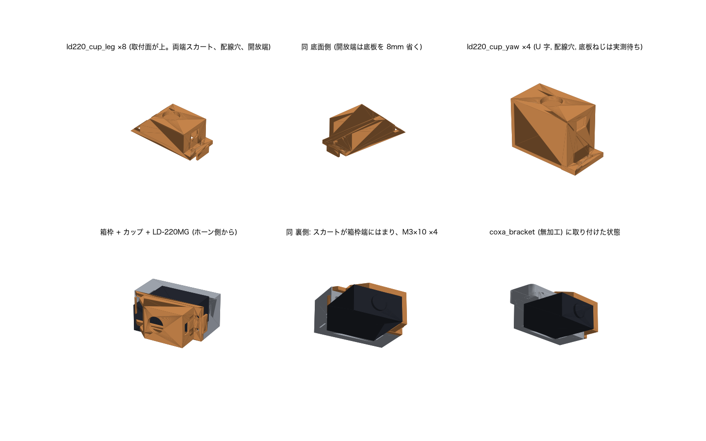

# LD-220MG 用 固定カップ (2026-09-05)

届いた脚サーボが **Hiwonder LD-220MG** (タブ無しケース) だったため、既存の
印刷済みパーツ (coxa_bracket / femur_link / chassis) を作り直さずに固定する
ためのカップ。生成は `hardware/src/make_ld220_cup.py`、検証は
`tools/check_ld220_cup.py`。根拠写真は `userInput/IMG_1899〜1910.jpeg`。

## 何が問題だったか

| 項目 | DS3218MG (設計前提) | LD-220MG (実物) |
|---|---|---|
| ケース外形 | 40.7 × 20.2 (config STD) | **40.0 × 20.0 (実測)** |
| 固定方法 | 側面タブ (54.5 スパン) を M3 ×4 | タブ無し。上下面のねじ穴 + 底面の補助軸ボス |
| 配線の出口 | 出力軸の反対側の端面 (箱枠の -X 端に逃がし穴あり) | **出力軸側の端面の底面寄り** (箱枠の外 = カップの端壁の位置に出る) |

断面を実測して分かった既存設計の事実 (`servo_frame()`):
タブ用スロット (y 0〜9) の上に 4.1 mm の天井が残っており、**DS3218 でも
タブを差し込めない形状**だった。LD-220MG は 41.1×20.6 の貫通ポケットを
そのまま通るので、この問題は今回のカップ方式では顕在化しない。

## 設計

- 箱枠の +Y 面 (ホーン側) は関節相手の円板内面まで **1.8 mm** しか無いので、
  上面側には何も置けない。よって **ケース底面側から被せる**。
- カップの底板がケース底面に当たってケースの Y 位置 (= ホーンの高さ) を決め、
  側壁 (はめあい 0.2) が横方向を決め、フランジを**既存のタブ穴 (φ2.8 貫通)**
  に M3×10 タッピング ×4 で固定する。ビスは箱枠の -Y 面側から。
- ケース上面の Y は DS3218 と同じ 11.0 (ホーンアーム上面 17.5) に合わせてある。
  **LD-220MG のケース高さ H と、上面〜ホーンアーム上面の距離 HORN_TOP を
  実測して `config.py` の `LD220` を更新してから印刷すること** (H が違うと
  ホーンの高さがそのままずれる)。
- **出力軸から遠い側 (-x) は端壁を持たない開放端**で、さらにその端から 8 mm は
  底板と側壁の下部 (ケース底面より下の肉) を省いてある。後脚の股ピッチカップは
  ポッド側ヨー (firmware `LIM_YAW_POD` = 30°, 2026-09-04 に 22°→30°) でバッテリー
  パックの側面がちょうどケース底面の高さを通るため、そこに肉があると食い込む
  (端壁ありで 0.15 cm³、面取りだけでは 0.07 cm³ 残った)。x 方向の位置決めは
  配線穴側の端壁と箱枠ポケットが担う。底板はケース底面の 32 mm / 40 mm を受ける。
  なお LD-220MG のケース自体も H=40.5 の仮定では同条件で 0.7 mm (0.005 cm³) 触れる
  (DS3218 より 1.3 mm 深いため)。H の実測値が 39.5 以下なら触れない。
- **既存の印刷物は無加工**。配線は出力軸側の端壁に開けた 9×7 mm の穴
  (コネクタごと通る) から出す。フランジの両端には箱枠の端面にはまる
  スカート (厚 1.5・高さ 3・幅 13) があり、被せた時点で位置が決まる。
  ねじは位置決めではなく抜け止め。

### 出力ファイル (`hardware/stl/`)

| ファイル | 数量 | 用途 |
|---|---|---|
| `ld220_cup_leg.stl` | **8** | 股ピッチ 4 + 膝 4。ミラー脚も同じ部品 (裏返して使う) |
| `ld220_cup_yaw.stl` | **4** | シャーシのヨーサーボ。上から被せる (下記の注意) |

印刷: PETG、壁 4・インフィル 40%。**フランジ面 (取付面) を下**にして印刷。
両端のスカート (3 mm) が先に接地するので、フランジの下にだけサポートを付ける
(底板は 20.4 mm のブリッジになるが PETG で問題ない範囲)。

## 組み方 (脚: 股ピッチ / 膝) — 箱枠は削らない

1. LD-220MG を中立 (1500µs) にする。
2. カップの端壁の配線穴に、**コネクタごと配線を通す**。
3. 箱枠の +Y 側 (ホーン側) からサーボをポケットへ入れる。配線は底面寄りの
   端面から出るので、箱枠の裏側 (-Y) に出る。
4. 箱枠の -Y 面にカップを被せる。両端のスカートが箱枠の端面にはまる。
5. **M3×10 タッピング ×4** を既存のタブ穴へ。ビス頭はフランジ上に座る
   (端壁に逃がしあり)。
6. ホーンは DS3218 と同じ位置 (tibia / femur の円板ポケット) に共締め。

## ヨーサーボ (シャーシ) — 注意

`ld220_cup_yaw` は **U 字** (内側端に壁とフランジが無い) で、外側端の 2 本の
ビスだけでシャーシに付く。理由: シャーシ実測で、ヨー開口の内側端 (中央寄り)
が PCA9685 下段基板の下面 (z=9) と基板ボスの真下にあり、**DS3218 のタブ座面
(z 7〜10) でも当たる配置**だったため (後脚で 0.048 cm³、`check_ld220_cup.py`
[4] の参考値)。

ヨーサーボは脚を吊るので、カップの底板をサーボ底面のねじ穴に留めないと
サーボが開口から下へ抜ける。**底面ねじ穴のピッチと径を実測して
`config.py` の `LD220["BOT_HOLES"] = (x ピッチ, z ピッチ, 径)` に入れてから
`make_ld220_cup.py` を再実行**すること (写真からの読みでは幅方向 15〜16 mm、
長手 33〜37 mm の 2 段構成に見えるが未確定)。実測が入るまで `ld220_cup_yaw`
は印刷しない。

## 検証結果 (`tools/check_ld220_cup.py`, 2026-09-05)

- [1] カップ ∩ 箱枠 = 0、カップ ∩ coxa_bracket / femur_link (天板・ウェブ込み, ミラー含む) = 0、
  カップ ∩ ケース (はめあい込み) = 0、タブ穴 4 本が同軸
- [2] 脚 1 本の掃引 8 姿勢 × ミラー: coxa/femur/tibia/shin_shell 全て 0
- [3] `check_leg_assembly.py` をサーボ実体 = LD-220MG + カップに差し替えて
  全項目実行: 隣接脚 45° ペア / 遠ペア / ポッド / バッテリークレードル 全て OK
  (端壁ありでは LIM_YAW_POD=30° でクレードル検査 0.152 cm³ NG だった。開放端 + 底板 8 mm 省略でカップ単体 0、ケース込み 0.005)
- [4] ヨー用カップ ∩ chassis = 0 (4 か所)。RR のみ PCA プラグ列の包絡と
  0.08 cm³ 重なるが、これは DS3218 のケース/タブでも同じ包絡と重なる
  既存の箇所 (`make_head_eyecut.py` の包絡が保守的)

## 未確定 (UNVERIFIED) と管理者判断待ち

- `LD220`: H / HORN_TOP / REAR_BOSS_D,H / WIRE_ABOVE_BOT / BOT_HOLES は
  写真からの読み。**ノギスで実測して更新** → `make_ld220_cup.py` → 本チェッカー。
- LD-220MG は 270° 版の可能性がある。ファームは 500〜2500µs = 180° 前提
  (`firmware/src/config.h` DEG_RANGE)。実測して違えば DEG_RANGE を変える。
- 頭シェルのクリアランス検証 (`make_head_eyecut.py` 検算 [3]) はヨーサーボの
  ケースを「ボス上面 + 11 mm」の箱で近似しているが、実際のケースはボス上面
  から 28.2 mm (DS3218) / 29.5 mm + カップ 3 mm (LD-220MG) 立ち上がる。
  **頭シェル内側との干渉は未検証**。
